<h2>TensorFlow-FlexUNet-Image-Segmentation-IRCAD-Digestive-Cancer-Liver (2026/03/15)</h2>
Sarah T.  Arai 
Software Laboratory antillia.com  
This is the first experiment of Image Segmentation for <b>IRCAD-Digestive-Cancer-Liver</b> based on our <a href="./src/TensorFlowFlexUNet.py">TensorFlowFlexUNet</a> 
(TensorFlow Flexible UNet Image Segmentation Model for Multiclass) 
and a 512x512 pixels PNG
<a href="https://drive.google.com/file/d/1g_jsjb3FhS7JnZDnPyvx2Pz0T2Pc0ggB/view?usp=sharing">
<b>IRCAD-Digestive-Cancer-ImageMask-Dataset.zip</b></a>  (<a href="https://cdla.dev/sharing-1-0/">Community Data License Agreement – Sharing, Version 1.0</a>
), which was derived by us from   
<a href="https://www.kaggle.com/datasets/fattahuzzaman/ircadresearch-institute-against-digestive-cancer">
<b>(IRCAD)Research Institute against Digestive Cancer</b> </a> on the kaggle.com.
  

<b>Actual Image Segmentation for IRCAD-Digestive-Cancer (Liver) Images of 512x512 pixels </b> 
As shown below, the inferred masks predicted by our segmentation model trained by the dataset appear similar to the ground truth masks.
 
  
<table>
<tr>
<th>Input: image</th>
<th>Mask (ground_truth)</th>
<th>Prediction: inferred_mask</th>
</tr>
<tr>
<td>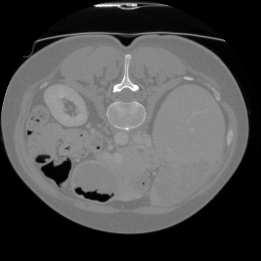</td>
<td></td>
<td></td>
</tr>

<tr>
<td>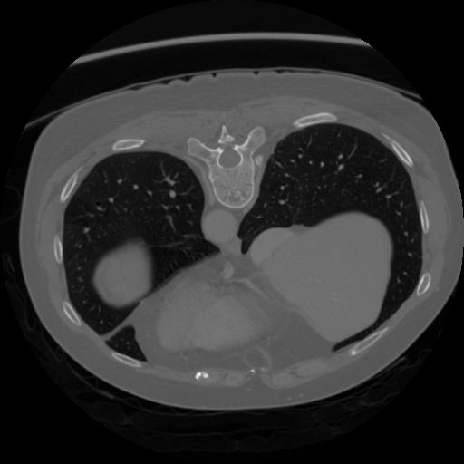</td>
<td></td>
<td></td>
</tr>

<tr>
<td>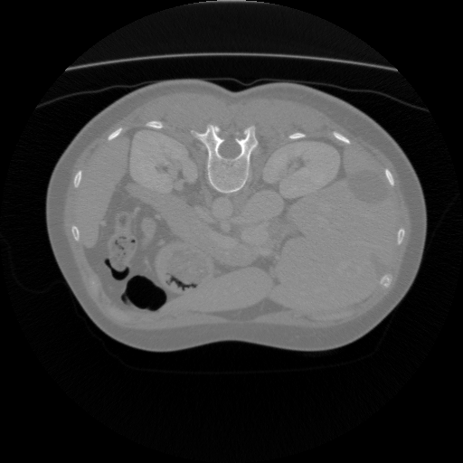</td>
<td></td>
<td></td>
</tr>
</table>

 
<h3>1  Dataset Citation</h3>
The dataset used here was derived from   
<a href="https://www.kaggle.com/datasets/fattahuzzaman/ircadresearch-institute-against-digestive-cancer">
<b>(IRCAD)Research Institute against Digestive Cancer</b> </a>  
<b>Liver segmentation project</b>.
  
The following explanation was taken from the kaggle web site.
  
<b>About Dataset</b> 
<b>Context</b> 
IIRCAD (Research Institute against Digestive Cancer) was founded in 1994. It pools digestive cancer research laboratories, 
a research and development project.  
IRCAD’s research orientation has always been directed towards the development of less 
invasive surgical techniques. The development of concepts and instruments enabled the IRCAD team to carry out the first 
fully natural orifice transluminal endoscopy surgical (NOTES) procedure in April 2007.  
The parallel development of a training structure was the logical extension of the groundbreaking work at IRCAD.  
Every year, 6,200 surgeons from all over the world are trained by a team of 642 international experts. The IRCAD made 
it possible for surgeons from the entire world to obtain high-level skills, and as a result, 
the Institute maintained its position as an ambassador of French excellence.

  
<b>Content</b> 
<b>This database is composed of the CT-scans of 10 women and 10 men with hepatic tumors in 75% of cases. </b>
Where appropriate, the segment number corresponding to the location of tumors is also provided.  
All the data is in 3D format and in nifti files. 
The images are arranged sequentially with original image and segmented liver image.
 
 
<b>Acknowledgements</b> 
<a href="https://www.ircad.fr/research/computer/">https://www.ircad.fr/research/computer/</a>
  

<b>License</b> 
<a href="https://cdla.dev/sharing-1-0/">Community Data License Agreement – Sharing, Version 1.0</a>
 
 
<h3>
2 IRCAD-Digestive-Cancer ImageMask Dataset
</h3>
 If you would like to train this IRCAD-Digestive-Cancer Segmentation model by yourself,
please down load our dataset <a href="https://drive.google.com/file/d/1g_jsjb3FhS7JnZDnPyvx2Pz0T2Pc0ggB/view?usp=sharing">
<b>IRCAD-Digestive-Cancer-ImageMask-Dataset.zip</b> (<a href="https://cdla.dev/sharing-1-0/">Community Data License Agreement – Sharing, Version 1.0</a>
)
</a> on the google drive, expand the downloaded, and put it under <b>./dataset/</b> to be.
<pre>
./dataset
└─IRCAD-Digestive-Cancer
    ├─test
    │   ├─images
    │   └─masks
    ├─train
    │   ├─images
    │   └─masks
    └─valid
        ├─images
        └─masks
</pre>
We used a simple Python script <a href="./generator/ImageMaskDatasetGenerator.py">ImageMaskDatasetGenerator.py</a> 
to generate our PNG dataset from the original Digestive Cancer dataset (.nii files).  

<b>IRCAD-Digestive-Cancer Statistics</b> 
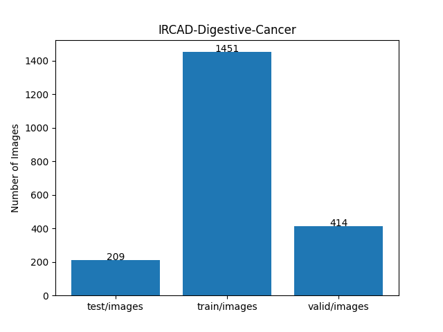 
 
As shown above, the number of images of train and valid datasets is not so large to use for a training set of our segmentation model.
  

<b>Train_images_sample</b> 
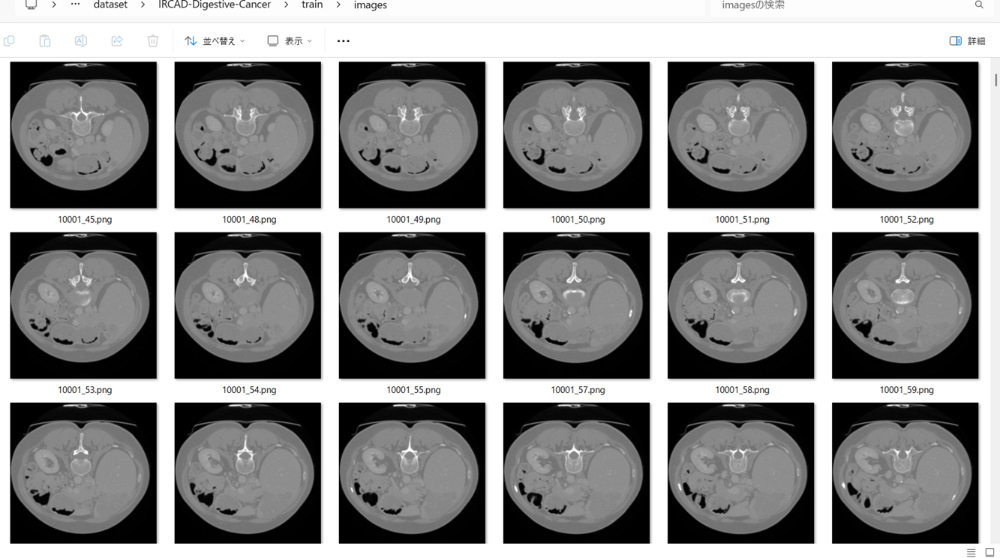
 
<b>Train_masks_sample</b> 
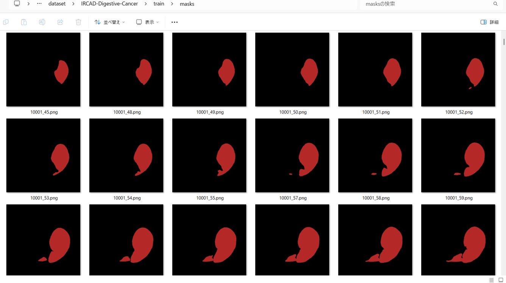
 
<h3>
3 Train TensorflowFlexUNet Model
</h3>
 We trained IRCAD-Digestive-Cancer TensorflowFlexUNet Model by using the following
<a href="./projects/TensorFlowFlexUNet/IRCAD-Digestive-Cancer/train_eval_infer.config"> <b>train_eval_infer.config</b></a> file.  
Please move to ./projects/TensorFlowFlexUNet/IRCAD-Digestive-Cancer, and run the following bat file. 
<pre>
>1.train.bat
</pre>
, which simply runs the following command. 
<pre>
>python ../../../src/TensorFlowFlexUNetTrainer.py ./train_eval_infer.config
</pre>

<b>Model parameters</b> 
Defined a small <b>base_filters=16</b> and a large <b>base_kernels=(11,11)</b> for the first Conv Layer of Encoder Block of 
<a href="./src/TensorFlowFlexUNet.py">TensorFlowFlexUNet.py</a> 
and a large num_layers (including a bridge between Encoder and Decoder Blocks).
<pre>
[model]
image_width    = 512
image_height   = 512
image_channels = 3
input_normalize = True
normalization  = False
num_classes    = 2
base_filters   = 16
base_kernels  = (11,11)
num_layers    = 8
dropout_rate   = 0.04
dilation       = (1,1)
</pre>
<b>Learning rate</b> 
Defined a small learning rate.  
<pre>
[model]
learning_rate  = 0.00007
</pre>
<b>Loss and metrics functions</b> 
Specified "categorical_crossentropy" and "dice_coef_multiclass". 
<pre>
[model]
loss           = "categorical_crossentropy"
metrics        = ["dice_coef_multiclass"]
</pre>
<b >Learning rate reducer callback</b> 
Enabled learing_rate_reducer callback, and a small reducer_patience.
<pre> 
[train]
learning_rate_reducer = True
reducer_factor     = 0.5
reducer_patience   = 4
</pre>
<b>Early stopping callback</b> 
Enabled early stopping callback with patience parameter.
<pre>
[train]
patience      = 10
</pre>
<b></b> 
<b>RGB color map</b> 
rgb color map dict for IRCAD-Digestive-Cancer 1+1 classes. 
<pre>
[mask]
mask_file_format = ".png"
;IRCAD-Digestive-Cancer 1+1
;                     liver: brown
rgb_map = {(0,0,0):0, (180,40,40):1, }
</pre>
<b>Epoch change inference callbacks</b> 
Enabled epoch_change_infer callback. 
<pre>
[train]
epoch_change_infer       = True
epoch_change_infer_dir   =  "./epoch_change_infer"
epoch_changeinfer        = False
epoch_changeinfer_dir    = "./epoch_changeinfer"
num_infer_images         = 6
</pre>
By using this epoch_change_infer callback, on every epoch_change, the inference procedure can be called
 for 6 images in <b>mini_test</b> folder. This will help you confirm how the predicted mask changes 
 at each epoch during your training process.    
<b>Epoch_change_inference output at starting (1,2,3)</b> 
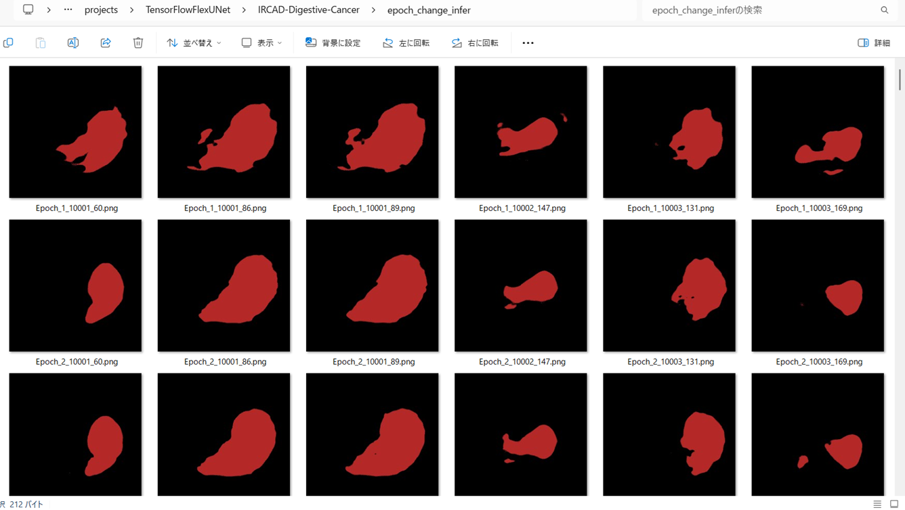 
 
<b>Epoch_change_inference output at middle-point (26,27,28)</b> 
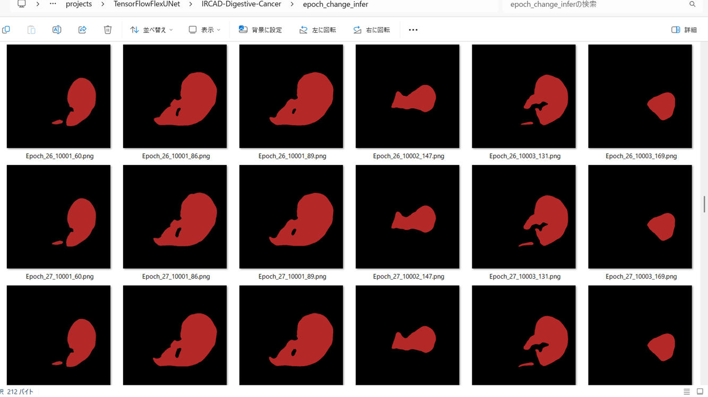 
 
<b>Epoch_change_inference output at ending (54,55,56)</b> 
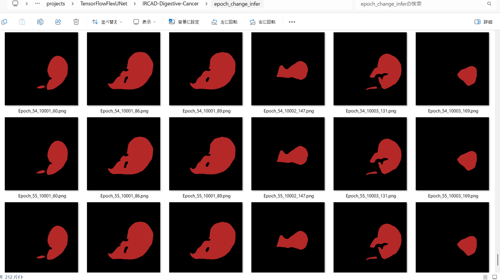 

 
In this experiment, the training process was stopped at epoch 56 by EarlyStoppingCallback.  
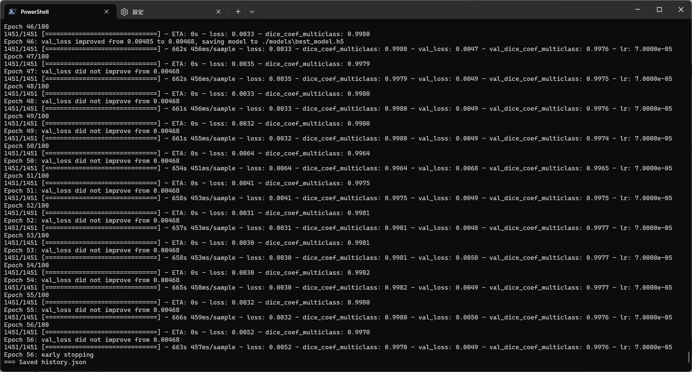 
 
<a href="./projects/TensorFlowFlexUNet/IRCAD-Digestive-Cancer/eval/train_metrics.csv">train_metrics.csv</a> 
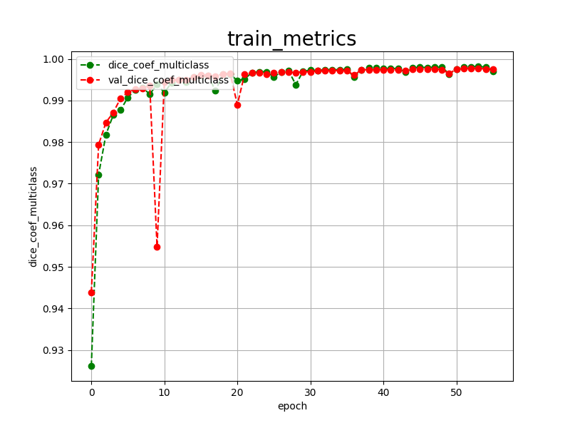 

 
<a href="./projects/TensorFlowFlexUNet/IRCAD-Digestive-Cancer/eval/train_losses.csv">train_losses.csv</a> 
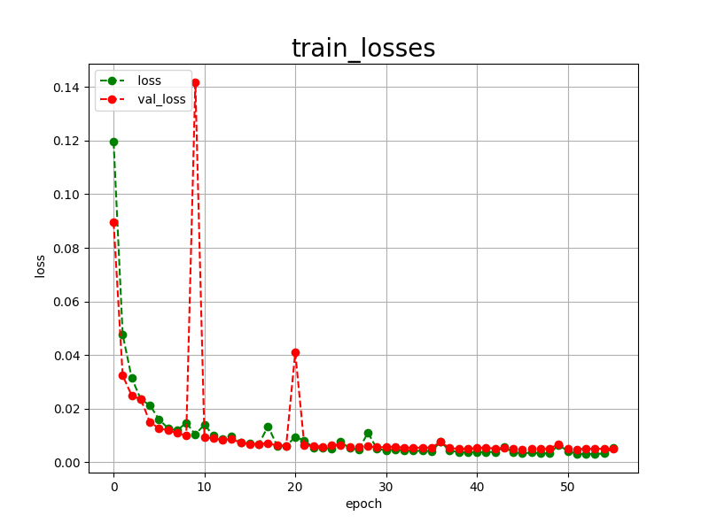 
 
<h3>
4 Evaluation
</h3>
Please move to a <b>./projects/TensorFlowFlexUNet/IRCAD-Digestive-Cancer</b> folder, and run the following bat file to evaluate TensorflowFlexUNet model for IRCAD-Digestive-Cancer. 
<pre>
>./2.evaluate.bat
</pre>
This bat file simply runs the following command.
<pre>
>python ../../../src/TensorFlowFlexUNetEvaluator.py  ./train_eval_infer.config
</pre>
Evaluation console output: 
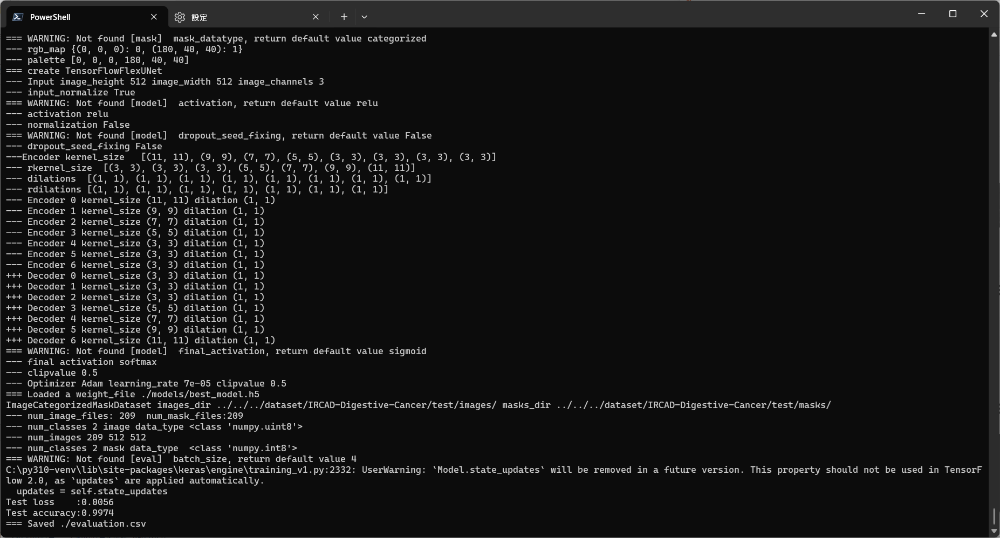
  Image-Segmentation-IRCAD-Digestive-Cancer

<a href="./projects/TensorFlowFlexUNet/IRCAD-Digestive-Cancer/evaluation.csv">evaluation.csv</a> 
The loss (categorical_crossentropy) to this IRCAD-Digestive-Cancer/test was very low, and dice_coef_multiclass  very high as shown below.
 
<pre>
categorical_crossentropy,0.0056
dice_coef_multiclass,0.9974
</pre>
 
<h3>5 Inference</h3>
Please move to a <b>./projects/TensorFlowFlexUNet/IRCAD-Digestive-Cancer</b> folder, and run the following bat file to infer segmentation regions for images by the Trained-TensorflowFlexUNet model for IRCAD-Digestive-Cancer. 
<pre>
>./3.infer.bat
</pre>
This simply runs the following command.
<pre>
>python ../../../src/TensorFlowFlexUNetInferencer.py ./train_eval_infer.config
</pre>

<b>mini_test_images</b> 
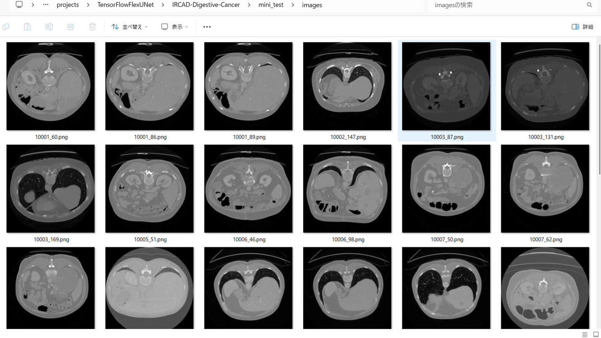 
<b>mini_test_mask(ground_truth)</b> 
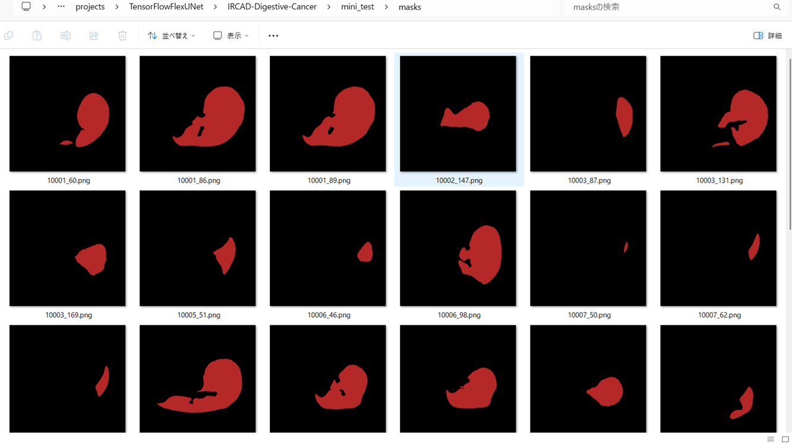 

<b>Inferred test masks</b> 
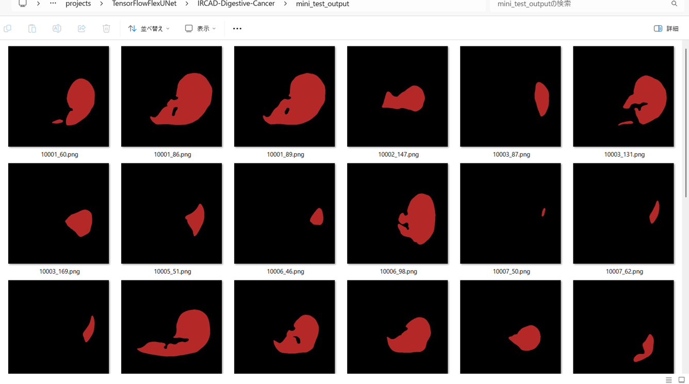 
 

<b>Enlarged images and masks for IRCAD-Digestive-Cancer(Liver) Images of 512x512 pixels</b> 
As shown below, the inferred masks predicted by our segmentation model trained by the dataset appear similar to the ground truth masks.
 
 
<table>
<tr>
<th>Input: image</th>
<th>Mask (ground_truth)</th>
<th>Prediction: inferred_mask</th>
</tr>
<tr>
<td>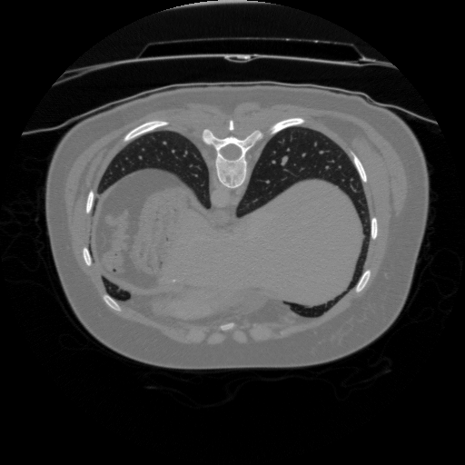</td>
<td></td>
<td></td>
</tr>

<tr>
<td>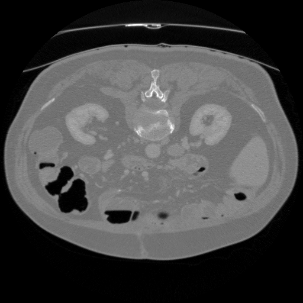</td>
<td></td>
<td></td>
</tr>

<tr>
<td>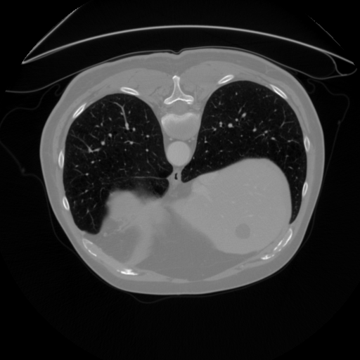</td>
<td></td>
<td></td>
</tr>
<tr>
<td>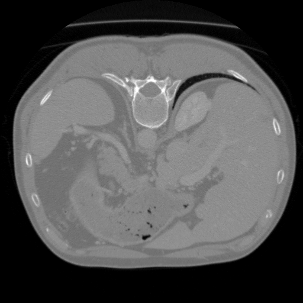</td>
<td></td>
<td></td>
</tr>
<tr>
<td>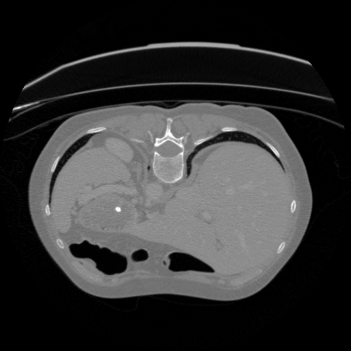</td>
<td></td>
<td></td>
</tr>
<tr>
<td>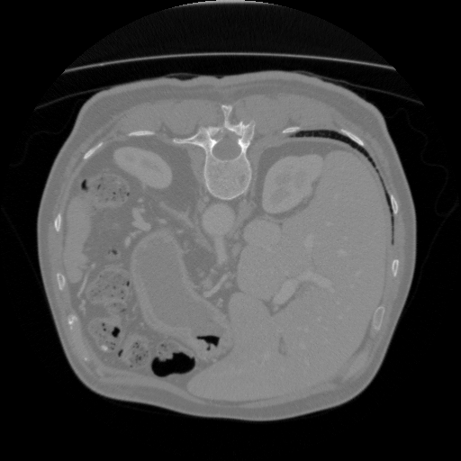</td>
<td></td>
<td></td>
</tr>
</table>

 
<h3>
References
</h3>
<b>1. Liver segmentation 3D-IRCADb-01</b> 
<a href="https://www.ircad.fr/research/data-sets/liver-segmentation-3d-ircadb-01/">
https://www.ircad.fr/research/data-sets/liver-segmentation-3d-ircadb-01/
</a>
 
 
<b>2. 3D Liver segmentation</b> 
<a href="https://www.kaggle.com/datasets/prathamgrover/3d-liver-segmentation/code">
https://www.kaggle.com/datasets/prathamgrover/3d-liver-segmentation/code
</a>
 
 
<b>3.TensorFlow-FlexUNet-Image-Segmentation-CHAOS-MR-T2SPIR-Multiclass</b> 
Toshiyuki Arai  
<a href="https://github.com/sarah-antillia/TensorFlow-FlexUNet-Image-Segmentation-CHAOS-MR-T2SPIR-Multiclass">
https://github.com/sarah-antillia/TensorFlow-FlexUNet-Image-Segmentation-CHAOS-MR-T2SPIR-Multiclass
</a>
 
 
<b>4. Tensorflow-Image-Segmentation-Liver-Tumor</b> 
Toshiyuki Arai  
<a href="https://github.com/sarah-antillia/Tensorflow-Image-Segmentation-Liver-Tumor">
https://github.com/sarah-antillia/Tensorflow-Image-Segmentation-Liver-Tumor
</a>
 
 
<b>5. TensorFlow-FlexUNet-Image-Segmentation-Model</b> 
Toshiyuki Arai  
<a href="https://github.com/sarah-antillia/TensorFlow-FlexUNet-Image-Segmentation-Model">
https://github.com/sarah-antillia/TensorFlow-FlexUNet-Image-Segmentation-Model
</a>
 
 
